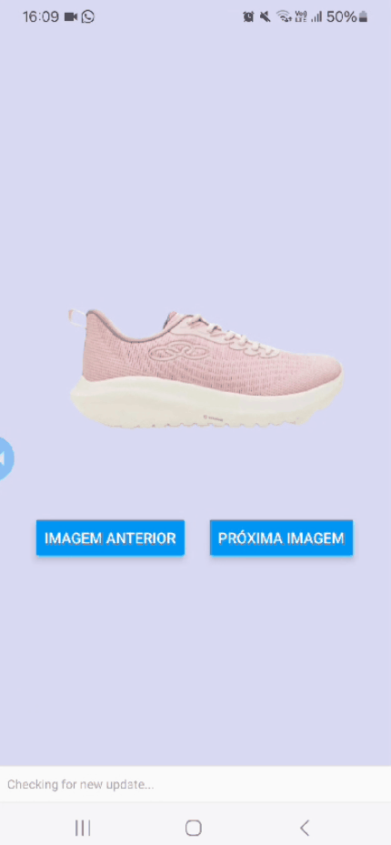

# SlideShopper

**SlideShopper** é um aplicativo simples desenvolvido em **React Native** que permite aos usuários navegar entre imagens de produtos usando botões de navegação.



## 🚀 Funcionalidades

- Visualização de imagens de produtos.
- Navegação entre imagens usando botões "Anterior" e "Próxima".
- Layout responsivo e simples.

## 📱 Tecnologias Utilizadas

- [React Native](https://reactnative.dev/)
- [JavaScript](https://developer.mozilla.org/pt-BR/docs/Web/JavaScript)
- Expo

## 🎨 Layout

O layout do app é simples e funcional, com as imagens centralizadas e botões de navegação posicionados na parte inferior.

---

## 🛠️ Como Rodar o Projeto

1. **Clone o repositório:**

   ```bash
   git clone https://github.com/henriquebdev/SlideShopper.git
   cd SlideShopper
   ```

2. **Instale as dependências:**

   Caso ainda não tenha o **Expo CLI** instalado, você pode instalá-lo globalmente com o seguinte comando:

   ```bash
   npm install -g expo-cli
   ```

   Após isso, instale as dependências do projeto:

   ```bash
   npm install
   # ou
   yarn install
   ```

3. **Execute o projeto com Expo:**

   Inicie o servidor do **Expo**:

   ```bash
   expo start
   ```

   Isso abrirá o **Expo Developer Tools** no seu navegador, e você poderá ver o aplicativo no seu dispositivo ou emulador. Você pode escanear o QR code com o app **Expo Go** no seu celular ou executar no seu emulador local.

---

